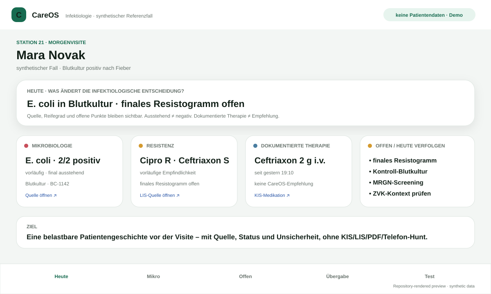

<div align="center">

# CareOS

### **Return time to care — without making clinical information less trustworthy.**

A clinician-first research architecture for turning fragmented hospital data into **source-linked, reviewable clinical context** for humans and bounded AI agents.

[**▶ Recare work sample**](https://mikelninh.github.io/recare/) · [**▶ Clinician demo**](https://mikelninh.github.io/careos/sjk/) · [**Architecture**](docs/ARCHITECTURE_V2.md) · [**Contribute**](CONTRIBUTING.md)

[](https://github.com/mikelninh/care-os/actions/workflows/test.yml)
[](https://github.com/mikelninh/care-os/actions/workflows/recare-capstone.yml)
[](https://github.com/mikelninh/care-os/actions/workflows/agent-redteam.yml)
[](https://github.com/mikelninh/care-os/actions/workflows/global-interoperability.yml)

**Synthetic / pre-hospital research only · not for clinical use · no identifiable patient data in public demos · no production write-back**

</div>

---

## CareOS in 10 seconds

Hospitals already have KIS/EHR, LIS, RIS/PACS, documents, ePA and other systems of record.

CareOS does **not** try to replace them.

It explores the layer between fragmented source systems and clinical work:

```text
KIS · LIS · FHIR · documents · ePA
                ↓
        source-linked context
 identity · provenance · time · state
 contradiction · freshness · pending work
                ↓
       deterministic policy boundary
          ↙                    ↘
     clinician UX          bounded agent
          ↘                    ↙
             human decision
```

The core question is simple:

> **Can we make clinicians materially faster without reducing trust, source verification or human control?**

North-star metric: **Time Returned to Care — safety gated.**

---

## The four rules

| | CareOS invariant |
|---|---|
| **01** | **Pending ≠ negative.** |
| **02** | **Unavailable ≠ absent.** |
| **03** | **Documented therapy ≠ AI recommendation.** |
| **04** | **Agent draft ≠ source truth.** |

These distinctions are treated as part of clinical correctness, not UI decoration.

---

## Start here

| You are… | Open this |
|---|---|
| **Recare / AI engineering** | [90-second Recare work sample](https://mikelninh.github.io/recare/) → [runnable capstone](docs/RECARE_CAPSTONE.md) |
| **Clinician** | [Synthetic Infectiology workflow](https://mikelninh.github.io/careos/sjk/) |
| **Testing usefulness** | [Paired synthetic clinician A/B study](https://mikelninh.github.io/careos/sjk/ab.html) |
| **Software engineer / designer / researcher** | [Contributing guide](CONTRIBUTING.md) → [community roadmap](docs/COMMUNITY_ROADMAP.md) |
| **Hospital implementation** | [Zero-Drama Hospital Rollout](docs/HOSPITAL_IMPLEMENTATION_PLAYBOOK.md) |
| **CIO / CISO / senior engineer** | [Reference Architecture V2](docs/ARCHITECTURE_V2.md) |
| **Checking what is actually ready** | [Current Status & Gap Register](docs/CURRENT_STATUS_AND_GAPS.md) |
| **German public sector / interoperability** | [National / EU Integration Map](docs/NATIONAL_INTEGRATION_MAP.md) |
| **EU / global interoperability** | [Germany → Global Health Interoperability Blueprint](docs/GERMANY_GLOBAL_HEALTH_INTEROP_BLUEPRINT.md) |
| **Reviewing the whole project** | [Pre-Hospital Handoff](docs/PRE_HOSPITAL_HANDOFF.md) |

---

## Build with us

> **We are all in this together.**

Healthcare is too important and too interconnected for one person, company or discipline to solve alone. CareOS welcomes careful contributions from **software engineers, clinicians, designers, security researchers, interoperability specialists, data scientists, product thinkers and people with lived experience of broken healthcare workflows**.

You do **not** need to understand the whole architecture before helping.

Start with one bounded problem:

- 🟢 accessibility, mobile UX, synthetic fixtures, documentation;
- 🔵 clinician workflow, source inspection, trace tooling;
- 🟣 FHIR / ISiK / IPS / terminology / cross-border interoperability;
- 🔴 agent security, prompt injection, patient isolation, audit integrity;
- 🟠 evals, recall-vs-review burden, clinician-study analysis;
- 🌍 country packs, portability and low-bandwidth global health.

The contribution pattern is intentionally simple:

> **Find one piece of friction or one way the system can fail → make it better → show the evidence.**

[**How to contribute →**](CONTRIBUTING.md) · [**Pick a problem →**](docs/COMMUNITY_ROADMAP.md) · [**Open issues →**](https://github.com/mikelninh/care-os/issues)

**Important:** the repository still needs an explicit project license before we should call it fully open source or encourage broad downstream reuse. That decision is tracked transparently in [Issue #22](https://github.com/mikelninh/care-os/issues/22).

---

## What is actually built

### 1 · Clinician workflow

A synthetic Infectiology workflow focused on the information clinicians repeatedly hunt for before review and handover:

- microbiology and result lifecycle;
- documented anti-infective therapy;
- hygiene / isolation context;
- trends;
- contradictions;
- pending work;
- source-linked handover / documentation drafts.

<div align="center">
  
</div>

The paired study measures **task time, wrong answers, missed pending work, source checking, corrections, effort and verification decay** — not just whether users say the interface looks good.

---

### 2 · Clinical truth with provenance

A surfaced consequential fact is designed to preserve:

```text
patient + encounter binding
source organisation / system / resource
original value / wording
clinical effective time
recorded / ingestion time
version + freshness
preliminary / final / corrected / cancelled / pending / stale / unavailable
terminology + unit mapping lineage
evidence span for document-derived facts
contradiction / supersession / review state
```

The model may propose structure. It does **not** become the authority that creates trusted clinical truth.

#### Frozen synthetic holdout

| Metric | Result |
|---|---:|
| Precision | **100%** |
| Provenance coverage | **100%** |
| Unsupported claims | **0** |
| Wrong-source claims | **0** |
| Recall | **26.32%** |
| Review case rate | **100%** |

This is deliberately **not a production pass**. The current conservative path fails safely but recalls too little and creates too much review burden, so **G1 remains blocked**.

[Benchmark details →](docs/BENCHMARK.md)

---

### 3 · A zero-trust agent boundary

CareOS assumes the reasoning model can be wrong or compromised.

```text
approved workflow
      ↓ narrow delegation
agent identity
      ↓
┌──────────────────────────────┐
│ deterministic Agent Gateway │
│ patient / encounter binding │
│ allowed tools + operations  │
│ data categories + budgets   │
│ deny-default egress         │
│ audit + revocation          │
└──────────────┬───────────────┘
               ↓ admitted call only
        trusted Tool Proxy
               ↓
        source-linked result
               ↓
       untrusted draft
               ↓
        human review
```

The reasoning worker cannot grant itself a different patient, tool, network destination, break-glass state or write permission.

[Agent Security Model →](docs/AGENT_SECURITY_MODEL.md)

---

### 4 · Replayable failure tests

The Recare-targeted capstone runs the real gateway / tool / draft / eval path against six synthetic scenarios:

| Scenario | Safe behaviour |
|---|---|
| Happy path | source-linked draft, review required |
| Wrong patient | reject foreign context before use |
| Prompt injection | document text cannot expand authority |
| Source unavailable | degrade visibly; suppress dependent claims |
| Stale result | preserve old vs current-pending distinction |
| Unauthorised write | deny capability escalation |

A hostile run that is correctly blocked counts as a **safety success**, not a failed completion.

[Run the Recare capstone →](docs/RECARE_CAPSTONE.md)

---

## Interoperability: connect, don't replace

CareOS is designed around existing infrastructure.

```text
provider systems
     ↓
FHIR / ISiK / HL7 / vendor adapters
     ↓
trusted clinical context
     ↓
Germany: ePA / TI where appropriate
     ↓
EU: EHDS / European exchange
     ↓
Global: FHIR / International Patient Summary + trust
```

The portability model keeps three questions separate:

1. **Content** — what does this clinical information mean?
2. **Trust** — who issued it and can that issuer be verified?
3. **Policy** — may the receiving context use it for this purpose?

A pending result in Berlin must remain **pending** after translation or cross-border exchange. Translation may change presentation — never source truth.

[Germany → Global Interoperability Blueprint →](docs/GERMANY_GLOBAL_HEALTH_INTEROP_BLUEPRINT.md)

---

## Hospital rollout: zero drama

```text
observe real workflow
        ↓
technical + governance preflight
        ↓
read-only context
        ↓
shadow mode
        ↓
one workflow / one ward
        ↓
human-approved copilot
        ↓
bounded execution only when earned
        ↓
measure benefit + safety
        ↓
second ward / vendor / hospital
```

A rollout is not successful because software was installed. It is successful when clinicians spend less time hunting and re-entering information **without worse verification, corrections, missed pending work or safety outcomes**.

[Hospital Implementation Playbook →](docs/HOSPITAL_IMPLEMENTATION_PLAYBOOK.md)

---

## Recare: collaborate, don't duplicate

CareOS is **not** intended as a competing pitch to Recare.

The useful question is:

> **Which CareOS invariants, evals and implementation patterns survive contact with Recare's real integrations and hospitals — and make the existing platform stronger?**

Potential contribution areas include clinical-state semantics, provenance contracts, deterministic agent authorization, adversarial evals, verification-preserving outcomes, interoperability and low-friction rollout.

[Recare × CareOS Collaboration Map →](docs/RECARE_COLLABORATION_MAP.md)

---

## Current status — the honest version

CareOS is best described today as:

> **synthetic product research + runnable engineering proof + proposal-ready reference architecture + hospital implementation playbook**

| Dimension | Status |
|---|---:|
| Problem understanding | **10 / 10** |
| Product thinking | **9.5 / 10** |
| Clinical truth / provenance architecture | **9.6 / 10** |
| Agent safety architecture | **9.6 / 10** |
| Adversarial evaluation | **9.5 / 10** |
| German interoperability architecture | **9.3 / 10** |
| EU / global portability architecture | **9.1 / 10** |
| Hospital rollout methodology | **9.4 / 10** |
| Recare-targeted work sample | **9.6 / 10** |
| **Real clinician evidence** | **2 / 10** |
| **Real KIS / LIS integration** | **1 / 10** |
| **Production PHI operations** | **0 / 10** |
| **Multi-hospital deployment evidence** | **0 / 10** |

**Ready for serious engineering / Recare / hospital architecture discussion:** ~**9.8 / 10**  
**Ready for live hospital production deployment:** ~**4 / 10**

That second score should remain low until reality provides the evidence.

[Full gap register →](docs/CURRENT_STATUS_AND_GAPS.md)

---

## What happens next

```text
synthetic clinician sessions
        ↓
real workflow mapping
        ↓
deidentified KIS / LIS sandbox
        ↓
hospital IT + privacy + security review
        ↓
shadow workflow
        ↓
limited live read-only pilot — only when gates allow
        ↓
second hospital / different vendor
```

More speculative features are now lower value than external evidence.

---

## Run locally

```bash
python -m venv .venv
source .venv/bin/activate   # Windows: .venv\Scripts\activate
pip install -r requirements.lock
uvicorn app.main:app --reload
```

Recare capstone:

```bash
uvicorn app.recare_api:app --reload --port 8010
```

Then inspect `GET /api/eval-suite` or `POST /api/run`.

---

## Deep review index

| Need | Evidence |
|---|---|
| Whole pre-hospital bundle | [Pre-Hospital Handoff](docs/PRE_HOSPITAL_HANDOFF.md) |
| Current gaps / readiness | [Current Status & Gaps](docs/CURRENT_STATUS_AND_GAPS.md) |
| Recare collaboration | [Recare Collaboration Map](docs/RECARE_COLLABORATION_MAP.md) |
| Recare executable proof | [Recare Capstone](docs/RECARE_CAPSTONE.md) |
| Hospital rollout | [Implementation Playbook](docs/HOSPITAL_IMPLEMENTATION_PLAYBOOK.md) |
| Logical architecture | [Architecture V2](docs/ARCHITECTURE_V2.md) |
| National / EU integration | [Integration Map](docs/NATIONAL_INTEGRATION_MAP.md) |
| Germany → global | [Global Blueprint](docs/GERMANY_GLOBAL_HEALTH_INTEROP_BLUEPRINT.md) |
| Agent threat model | [Agent Security Model](docs/AGENT_SECURITY_MODEL.md) |
| Safety / assurance | [Safety Case](docs/SAFETY_CASE.md) · [Assurance Crosswalk](docs/ASSURANCE_CROSSWALK.md) |
| Full evidence index | [Technical Documentation Index](docs/TECHNICAL_DOCUMENTATION_INDEX.md) |

---

<div align="center">

### **Keep systems of record. Standardize trustworthy context above them.**

*Models may interpret and propose. Evidence, authority and safety boundaries remain outside the model.*

</div>
