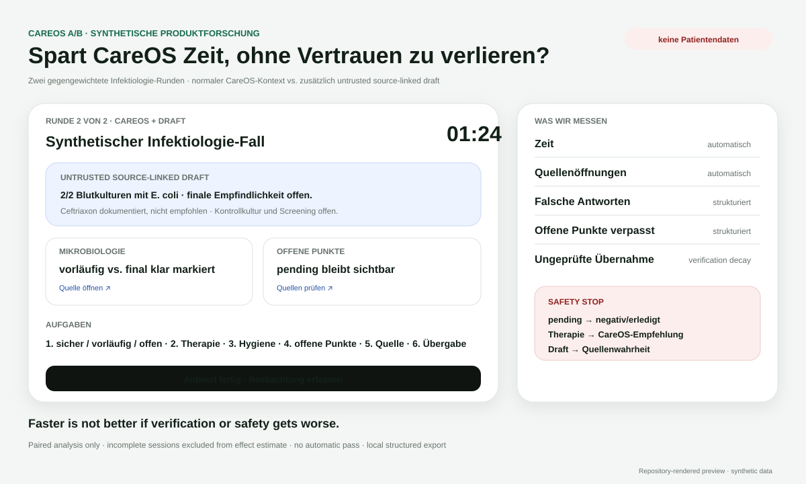

# CareOS

> **Patient history without the hunt. Document once, reuse safely.**

[](https://github.com/mikelninh/care-os/actions/workflows/test.yml)
[](https://github.com/mikelninh/care-os/actions/workflows/platform-redteam.yml)
[](https://github.com/mikelninh/care-os/actions/workflows/agent-redteam.yml)
[](https://github.com/mikelninh/care-os/actions/workflows/supply-chain-security.yml)

CareOS is a **clinician-first, federated clinical context layer** for fragmented healthcare systems.

It is designed to sit beside KIS/PVS/EHR/LIS/RIS/ePA systems rather than replace them: bring the relevant patient story together, keep every consequential fact traceable to its source, preserve uncertainty and pending work, and return time to care without creating another system of record.

**First specialty:** Infectiology.  
**Current stage:** synthetic product research + proposal-ready reference architecture.  
**Not for clinical use. No identifiable patient data is used in the public demos.**

## Start here

| Audience | Link |
|---|---|
| Clinicians / Infectiology team | **[SJK synthetic workflow demo](https://mikelninh.github.io/careos/sjk/)** |
| Clinician A/B test | **[CareOS vs CareOS + source-linked draft](https://mikelninh.github.io/careos/sjk/ab.html)** |
| Chefarzt / medical leadership | **[Leadership view](https://mikelninh.github.io/careos/sjk/chef.html)** |
| Senior engineers / CIO / CISO / Datenschutz | **[Reference Architecture V2](docs/ARCHITECTURE_V2.md)** |
| Government / public-sector review | **[German Government Reference Architecture](docs/GOVERNMENT_REFERENCE_ARCHITECTURE.md)** |

---

## What exists right now

- a synthetic Infectiology workflow focused on **morning review, microbiology, pending results, documented anti-infective therapy, hygiene/isolation and handover**;
- source-linked clinical facts with explicit provenance, lifecycle state, clinical time, freshness, contradiction/review state and patient/encounter binding;
- a structured FHIR/ISiK integration path with bounded paging, source-state semantics and hostile wrong-patient checks;
- a separate **zero-trust Agent Gateway** where models are untrusted proposers and deterministic policy controls patient scope, tools, data categories, budgets, egress and audit;
- dedicated platform and agent red-team CI, supply-chain checks, SBOM, CodeQL, non-root container and live-data startup locks;
- a paired synthetic clinician A/B study that measures **time, errors, missed pending work, source checking, corrections, cognitive effort and verification decay**;
- a government/CIO-grade reference architecture package covering deployment, trust boundaries, interoperability, responsibility, procurement and national/EU integration.

The current objective is simple:

> **Can CareOS make clinicians materially faster without making clinical information less trustworthy or reducing source verification?**

---

## Current clinician view


The Infectiology reference workflow emphasizes the distinctions that become dangerous when collapsed:

> **Pending ≠ negative. Unavailable ≠ absent. Documented therapy ≠ CareOS recommendation.**

The public SJK reference is synthetic product research only and is **not an official hospital system or endorsement**.

---

## Current clinician evidence test



The A/B study compares normal source-linked CareOS with CareOS plus an explicitly labelled **untrusted source-linked draft**.

The design is paired and counterbalanced. Incomplete sessions do not influence the estimated agent effect. A favorable speed result is overridden by safety-stop events such as:

- pending/unavailable interpreted as negative or complete;
- documented treatment interpreted as a CareOS recommendation;
- agent draft confused with source truth.

See the full [SJK Agent Study Protocol](docs/SJK_AGENT_STUDY_PROTOCOL.md).

---

# Architecture

## Reference architecture status: **10 / 10 proposal completeness**

This means **the architecture package is complete enough for serious review** by clinicians, Chefarzt/medical leadership, hospital CIO/CISO/Datenschutz, senior engineers, government architects, gematik/public-sector stakeholders and funding partners.

It does **not** mean production approval, certification, clinical validation or permission to process live patient data.

### Core design

```text
                            CAREOS CONTROL PLANE

          releases · signed pack versions · policy/config bundles
       terminology metadata · guideline metadata · non-PHI operations
                                 │
                       no routine identifiable PHI
                                 │
═════════════════════════════════╪════════════════════════════════════
                                 │
                    PROVIDER / HOSPITAL DATA PLANE
                                 │
 KIS/EHR ─┐                      │
 LIS/Micro├───> Connector Gateway / Integration Boundary
 RIS/PACS ┤                      │
 PVS      ┤                      ▼
 ePA/TI   ┤              Identity + Encounter Layer
 KIM      ┤                      │
 Docs     ┘                      ▼
                         Clinical Truth Layer
                                 │
           provenance · time · freshness · terminology · units
                                 │
                                 ▼
                       Reconciliation Engine
                contradiction · supersession · review
                                 │
                                 ▼
                       Policy Enforcement Point
                          │                 │
                          ▼                 ▼
                      Human UX         Agent Gateway
                                            │
                                  narrow delegated tools
                                            │
                                            ▼
                                  untrusted reasoning worker
```

> **Keep systems of record. Standardize the trustworthy context layer above them.**

### Architectural invariants

1. Existing provider systems remain authoritative systems of record.
2. Routine identifiable patient data stays in the provider data plane or a dedicated provider-controlled tenant.
3. Provenance is part of correctness; consequential facts must be traceable to their source.
4. Missing, stale, unavailable, contradictory and negative are different states.
5. Models may propose structure but may not directly create trusted clinical truth.
6. Read and write are separate capabilities; read-only value must be proven first.
7. Names/DOB/address never silently merge patient records.
8. Production should receive trusted patient/encounter context from the surrounding clinical workflow rather than create another search box.
9. Specialty/country/language/audience behavior extends one core rather than creating product forks.
10. Source outage, partial reads and audit failure must fail visibly.

### Architecture package

| Question | Document |
|---|---|
| Full logical architecture | [Reference Architecture V2](docs/ARCHITECTURE_V2.md) |
| German public-sector model | [Government Reference Architecture](docs/GOVERNMENT_REFERENCE_ARCHITECTURE.md) |
| Executive German brief | [Government One-Pager DE](docs/GOVERNMENT_ONE_PAGER_DE.md) |
| PHI / trust boundaries / flows | [Trust & Data Flow](docs/TRUST_AND_DATA_FLOW.md) |
| On-prem / dedicated cloud / federated deployment | [Deployment Patterns](docs/DEPLOYMENT_PATTERNS.md) |
| ISiK / ISiP / TI / ePA / KIM / EHDS direction | [National & EU Integration Map](docs/NATIONAL_INTEGRATION_MAP.md) |
| Technical-review evidence index | [Technical Documentation Index](docs/TECHNICAL_DOCUMENTATION_INDEX.md) |
| Who owns which risk/control | [Responsibility Model](docs/RESPONSIBILITY_MODEL.md) |
| Assurance evidence | [Assurance Crosswalk](docs/ASSURANCE_CROSSWALK.md) |
| Vendor-neutral public procurement | [Procurement Requirements](docs/PROCUREMENT_REQUIREMENTS.md) |
| Durable design decisions | [Architecture Decision Records](docs/adr/README.md) |
| Machine-readable architecture | [`architecture/reference-architecture.json`](architecture/reference-architecture.json) |

---

# Clinical truth and AI boundary

```text
FHIR / KIS / LIS / documents
             ↓
       source / connector
             ↓
      untrusted candidates
             ↓
 exact source-evidence verification
             ↓
    ClinicalFact / TruthEnvelope
             ↓
 identity · provenance · time · units · terminology · source state
             ↓
 reconciliation / contradiction / review / freshness
             ↓
        policy enforcement
             ↓
          clinician view
```

A surfaced clinical fact is designed to preserve the original value/wording, source system and resource/document ID, source version where available, clinical effective time separately from ingestion time, normalization lineage, evidence span for document-derived facts, and explicit review/contradiction state.

Models may **not** silently invent clinical time, create unsupported facts, resolve conflicting sources by confidence, merge patient identities, turn missing information into a negative finding, or write directly into trusted clinical truth.

## Frozen unseen benchmark

The current conservative truth path was evaluated on a frozen 500-case synthetic holdout:

| Metric | Result |
|---|---:|
| Precision | **100%** |
| Provenance coverage | **100%** |
| Unsupported claims | **0** |
| Wrong-source claims | **0** |
| Critical silent field misses | **0** |
| Critical silent contradiction misses | **0** |
| Recall | **26.32%** |
| Review case rate | **100%** |

This is **not a production pass**. It shows that CareOS currently fails conservatively rather than confidently, but the document-extraction path remains far too conservative to return enough clinical time. G1 therefore remains blocked and this holdout is not used as tuning data.

See [Benchmark](docs/BENCHMARK.md).

---

# Agentic CareOS: assume the model can be compromised

CareOS does not treat an AI agent as “the doctor, automated.” An agent is a separately identified, narrowly delegated principal.

```text
Clinician / approved workflow
        ↓ signed narrow delegation
Workload identity
        ↓
┌──────────────────────────────────┐
│       CAREOS AGENT GATEWAY       │
│ identity + revocation            │
│ patient/encounter/task binding   │
│ versioned tool registry          │
│ deterministic authorization      │
│ record/page/tool/runtime budgets │
│ memory namespace                 │
│ audit · deny-default egress      │
└──────────────┬───────────────────┘
               │ admitted capability only
               ▼
      untrusted reasoning worker
               │
               ▼
          Agent Gateway
               │
               ▼
        trusted Tool Proxy
```

The reasoning worker cannot choose the authoritative organisation, patient, encounter, break-glass state, recursion policy or arbitrary network destination. Live identifiable PHI and consequential actions remain separately locked behind the normal CareOS gates plus agent-specific gates.

See [Agent Security Model](docs/AGENT_SECURITY_MODEL.md), [Agent Production Programme](docs/AGENT_PRODUCTION_PROGRAM.md) and [Phases 1–7](docs/AGENT_PHASES_1_7.md).

---

# Production-readiness gates

CareOS graduates by evidence, not version numbers.

| Gate | Current state | Main remaining evidence |
|---|---|---|
| G0 Scope & clinical safety | **EXTERNAL REVIEW** | independent clinical-safety + medical-software assessment |
| G1 Clinical truth | **BLOCKED** | materially higher recall with low review burden and preserved safety |
| G2 German interoperability | **PARTIAL** | real KIS/LIS/vendor sandbox + terminology/sync evidence |
| G3 Privacy & security | **PARTIAL** | provider IdP/KMS/audit/DSFA/pentest evidence |
| G4 Reliability | **PARTIAL** | target-environment load/recovery/SLO evidence |
| G5 Regulatory & quality | **EXTERNAL REVIEW** | formal applicability/classification + quality lifecycle |
| G6 Invisible workflow | **PARTIAL** | real KIS patient-context launch/no-second-search proof |
| G7 Hospital deployment | **PARTIAL** | provider-specific review and approvals |
| G8 Repeatability | **PARTIAL** | second hospital/vendor without a CareOS core fork |
| G9 Germany/EU scale | **BLOCKED** | actual national/EU integrations + multi-site evidence |

**No normal production gate is PASS. Identifiable live patient data remains locked.**

`CAREOS_DATA_MODE=live-readonly` refuses startup while G0–G5 are incomplete. Transactional/write-back mode remains unsupported.

See [GATES](docs/GATES.md), [Safety Case](docs/SAFETY_CASE.md), [Platform Stress Test](docs/PLATFORM_STRESS_TEST_2026-08-16.md) and [Hospital Assurance Pack](docs/HOSPITAL_ASSURANCE_PACK.md).

---

# Current evidence and hardening

Internal evidence currently includes:

- regression + workflow scenario tests;
- whole-platform adversarial/red-team CI;
- hostile-agent containment CI;
- wrong-patient FHIR/resource rejection;
- bounded FHIR pagination and source-state handling;
- pinned gematik ISiK5 structural/profile validation;
- cancellation/supersession safety tests;
- browser patient-switch race protection and clinical-string escaping;
- OIDC/JWT and treatment-context foundations;
- fail-closed secure reads, kill switches and audit foundations;
- non-root runtime, dependency lock, CodeQL, vulnerability audit and CycloneDX SBOM;
- code-enforced live-data and live-agent locks.

Still external before any identifiable live-data pilot: actual hospital KIS/LIS interfaces, hospital IdP/context launch, KMS/secrets/network/DLP deployment, protected audit/SIEM, DSFA/contractual review, applicable infrastructure assurance, recovery/load testing and independent penetration testing.

---

# Validation path

```text
synthetic clinician workflow test
        ↓
paired clinician A/B evidence
        ↓
actual workflow mapping + sponsor decision
        ↓
IT / Datenschutz / security discovery
        ↓
synthetic/deidentified KIS/LIS sandbox
        ↓
independent clinical/security/regulatory assurance
        ↓
shadow workflow study
        ↓
limited live read-only pilot — only when gates allow it
        ↓
second hospital / different vendor
```

The next highest-value evidence is **real clinician behavior on synthetic cases**, followed by a de-identified integration sandbox. More synthetic feature breadth is currently less valuable than proving that CareOS actually removes search/call/window-switch work without reducing verification.

---

## Run locally

```bash
python -m venv .venv
source .venv/bin/activate   # Windows: .venv\Scripts\activate
pip install -r requirements.lock
uvicorn app.main:app --reload
```

Useful endpoints:

- clinician UI: `http://127.0.0.1:8000/`
- API docs: `http://127.0.0.1:8000/docs`
- normal gate board: `http://127.0.0.1:8000/api/readiness/gates`
- agent gate board: `http://127.0.0.1:8000/api/readiness/agents`
- data-mode lock: `http://127.0.0.1:8000/api/readiness/data-mode`

---

## Safety status

**Synthetic/public prototype only. Not for clinical use.**

CareOS currently performs no production clinical writes, makes no autonomous diagnosis/treatment decisions, does not silently merge ambiguous patients, keeps source failure and uncertainty explicit, and refuses identifiable live-patient startup while its core assurance gates are incomplete.

README visuals are repository-rendered previews of the current synthetic interfaces, not literal clinical screenshots. See [`docs/screenshots/README_SCREENSHOTS_NOTE.md`](docs/screenshots/README_SCREENSHOTS_NOTE.md).