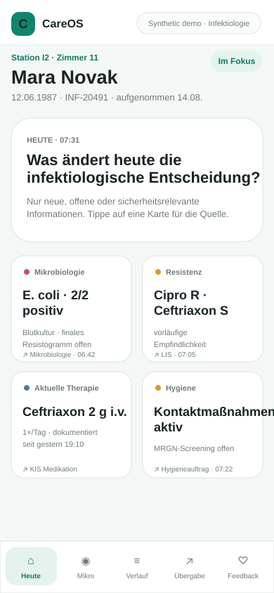
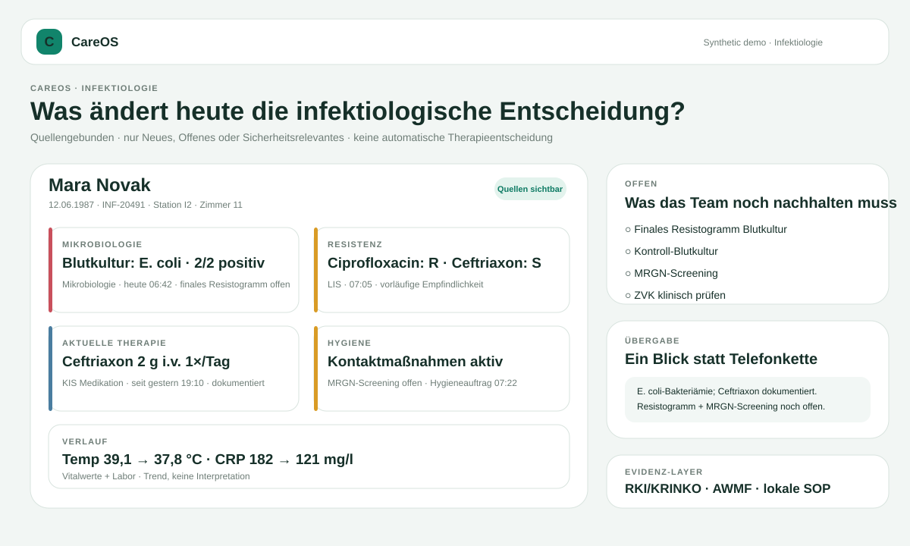

# CareOS

> **Patient history without the hunt. Document once, reuse safely.**

[](https://github.com/mikelninh/care-os/actions/workflows/test.yml)
[](https://github.com/mikelninh/care-os/actions/workflows/supply-chain-security.yml)

## What CareOS is

CareOS is a **clinician-first, federated clinical context layer** for fragmented healthcare systems.

It sits **beside** existing KIS/PVS/EHR/LIS/RIS/ePA systems rather than replacing them. The goal is to make the few patient facts that matter now immediately usable while keeping source, freshness, uncertainty, contradiction and open work visible.

CareOS is not designed to become a new national patient database. Routine identifiable patient data stays in the provider data plane or a dedicated provider-controlled tenant; the shared control plane distributes software, packs, policy/configuration and non-PHI operational metadata.

**Current product wedge:** Infectiology first.  
**Architecture direction:** one core + specialty + country + language + audience layers.

---

## Reference Architecture readiness

# **10 / 10 — proposal / reference-architecture package**

This score means the architecture is complete enough to put in front of a **Chefarzt, hospital CIO/CISO/Datenschutz team, government architect, gematik/public-sector stakeholder or funding partner for serious review**.

It does **not** mean CareOS is production-approved, certified, clinically validated, or cleared for identifiable live patient data.

The reference package includes:

- [**Reference Architecture V2**](docs/ARCHITECTURE_V2.md) — canonical technical architecture;
- [**German government reference architecture**](docs/GOVERNMENT_REFERENCE_ARCHITECTURE.md) — federated national proposal;
- [**Government one-pager (DE)**](docs/GOVERNMENT_ONE_PAGER_DE.md);
- [**Deployment patterns**](docs/DEPLOYMENT_PATTERNS.md) — on-prem/private, dedicated provider tenant, federated managed service;
- [**Trust boundaries & data flow**](docs/TRUST_AND_DATA_FLOW.md);
- [**Germany / EU integration map**](docs/NATIONAL_INTEGRATION_MAP.md);
- [**Technical documentation index**](docs/TECHNICAL_DOCUMENTATION_INDEX.md);
- [**Assurance crosswalk**](docs/ASSURANCE_CROSSWALK.md);
- [**Responsibility model**](docs/RESPONSIBILITY_MODEL.md);
- [**Public-sector procurement / anti-lock-in requirements**](docs/PROCUREMENT_REQUIREMENTS.md);
- [**Agent security model**](docs/AGENT_SECURITY_MODEL.md);
- [**Agent production programme**](docs/AGENT_PRODUCTION_PROGRAM.md);
- [**Agent security baseline**](docs/AGENT_SECURITY_BASELINE.md);
- [**Architecture Decision Records**](docs/adr/README.md);
- [**Reference-architecture scorecard**](docs/REFERENCE_ARCHITECTURE_SCORECARD.md);
- machine-readable [`architecture/reference-architecture.json`](architecture/reference-architecture.json) with CI invariants.

### The central architecture decision

```text
                            CAREOS CONTROL PLANE

          releases · pack versions · policy/config bundles
       terminology metadata · guidelines · non-PHI operations
                                 │
                       no routine identifiable PHI
                                 │
═════════════════════════════════╪════════════════════════════════════
                                 │
                    PROVIDER / HOSPITAL DATA PLANE
                                 │
 KIS/EHR ─┐                      │
 LIS/Micro├───> Connector Gateway / Integration Boundary
 RIS/PACS ┤                      │
 PVS      ┤                      ▼
 ePA/TI   ┤              Identity + Encounter Layer
 KIM      ┤                      │
 Docs     ┘                      ▼
                         Clinical Truth Layer
                                 │
           ┌─────────────────────┼─────────────────────┐
           ▼                     ▼                     ▼
     provenance/version     temporal/freshness    terminology/units
           │                     │                     │
           └─────────────────────┼─────────────────────┘
                                 ▼
                       Reconciliation Engine
                contradiction · supersession · review
                                 │
                                 ▼
                       Policy Enforcement Point
                          │               │
                          │               └──────────────┐
                          ▼                              ▼
                      Human UX                    Agent Gateway
                                                        │
                                             narrow delegated tools
                                                        │
                                                        ▼
                                            untrusted reasoning worker
```

**Keep systems of record. Standardize the trustworthy context layer above them.**

---

## Try it

### SJK Infectiology synthetic reference test

**Clinician / team test:** https://mikelninh.github.io/careos/sjk/  
**Chefarzt / leadership view:** https://mikelninh.github.io/careos/sjk/chef.html

### General CareOS demo

**Clinician demo:** https://mikelninh.github.io/careos/

> All public demos use **synthetic data only** and are not for clinical use. The SJK reference environment is a product-research prototype, not an official hospital system or endorsement.



---

## Production readiness is deliberately separate

CareOS graduates through **evidence-backed gates, not version numbers**.

| Gate | Status | Main blocker |
|---|---|---|
| G0 Scope & safety boundary | **EXTERNAL REVIEW** | independent clinical-safety + MDR/MDSW assessment |
| G1 Clinical truth | **BLOCKED** | safe but unusably conservative document recall/review burden |
| G2 German interoperability | **PARTIAL** | real KIS/LIS/vendor sandbox + terminology/sync evidence |
| G3 Privacy & security | **PARTIAL** | real provider IdP/KMS/audit/DSFA/pentest evidence |
| G4 Production reliability | **PARTIAL** | target-environment recovery/failure/SLO evidence |
| G5 Regulatory & quality | **EXTERNAL REVIEW** | formal classification/applicability + appropriate QMS lifecycle |
| G6 Invisible workflow integration | **PARTIAL** | real KIS patient-context launch / no-second-search proof |
| G7 Hospital deployment kit | **PARTIAL** | hospital-specific completion + responsible approvals |
| G8 Repeatable deployment | **PARTIAL** | Hospital A + different Hospital B/vendor without core fork |
| G9 National / EU scale | **BLOCKED** | actual national/EU integration + multi-site evidence |

**No normal production gate is marked PASS yet. Identifiable live patient data remains locked.**

The lock is enforced in code: `CAREOS_DATA_MODE=live-readonly` refuses startup while core gates G0–G5 are incomplete; transactional/write-back mode is unsupported by the current release policy.

See [GATES](docs/GATES.md), [Safety Case](docs/SAFETY_CASE.md), [Architecture V2](docs/ARCHITECTURE_V2.md) and [Hospital Assurance Pack](docs/HOSPITAL_ASSURANCE_PACK.md).

---

## Clinical truth architecture

Source systems and AI/extractors do **not** write directly into the clinician UI.

```text
FHIR / KIS / LIS / documents
             ↓
       source / connector
             ↓
      untrusted candidates
             ↓
 exact source-evidence verification
             ↓
    ClinicalFact / TruthEnvelope
             ↓
 identity · provenance · time · units · terminology · source state
             ↓
 reconciliation / contradiction / review / freshness
             ↓
        policy enforcement
             ↓
          clinician view
```

A surfaced clinical fact is expected to retain its original value/wording, source, source/resource ID, version/timestamps where available, clinical effective time separately from ingestion time, model/parser version, trust/review state and exact evidence for document-derived facts.

### AI is not the truth authority

Models may propose structure, but they may not:

- silently create trusted clinical facts;
- invent source offsets or clinical dates;
- resolve contradictory sources by confidence alone;
- merge patient identities;
- turn missing data into a negative finding;
- autonomously choose treatment or write back into production systems.

See [`app/clinical_truth.py`](app/clinical_truth.py), [`app/document_pipeline.py`](app/document_pipeline.py), [`app/extractors/model_schema.py`](app/extractors/model_schema.py) and [ADR-004](docs/adr/ADR-004-models-untrusted.md).

---

## Agentic CareOS: zero trust for the reasoning worker

CareOS does **not** treat an AI agent as “the doctor, automated.”

> **An agent is a separately identified, narrowly delegated principal. The model may reason; deterministic CareOS policy decides what it can see and do.**

A bedside agent is patient/encounter/task scoped by default. It cannot inherit a clinician browser session, arbitrary patient search, break-glass privilege, unrestricted network egress or production write capability.

```text
Clinician / approved workflow
          │
          │ signed narrow delegation
          ▼
      Agent Gateway
          │
          ├─ agent/version identity
          ├─ patient + encounter + task
          ├─ allowlisted tools/data
          ├─ expiry
          ├─ record/page/tool/runtime budgets
          ├─ deny-default egress
          ├─ isolated memory namespace
          └─ dual human+agent audit
          │
          ▼
  untrusted reasoning worker
          │ proposes tool call
          ▼
      Agent Gateway
          │ re-authorizes
          ▼
     admitted tool only
```

Current implemented Stage-0 foundations:

- [`app/agent_policy.py`](app/agent_policy.py) — narrow delegation authorization;
- [`app/agent_delegation.py`](app/agent_delegation.py) — Ed25519-signed delegation envelopes;
- [`app/agent_tools.py`](app/agent_tools.py) — versioned tool/risk registry;
- [`app/agent_runtime.py`](app/agent_runtime.py) — deterministic gateway, execution budgets and scoped memory namespace;
- [`app/agent_audit.py`](app/agent_audit.py) — PHI-minimized human+agent attribution;
- [`app/agent_readiness.py`](app/agent_readiness.py) — independent A0–A9 gates;
- [`app/synthetic_agent.py`](app/synthetic_agent.py) — signed, gateway-backed synthetic SJK morning-review flow;
- adversarial tests assume the reasoning worker may be hostile and verify that cross-patient access, unapproved tools/data/egress, break glass, recursion and budget bypass are denied.

### Agent readiness is a separate gate system

| Agent gate | Status |
|---|---|
| A0 Workload identity | **PARTIAL** |
| A1 Signed delegation | **PARTIAL** |
| A2 Tool least privilege | **PARTIAL** |
| A3 Injection/hijacking resilience | **BLOCKED** |
| A4 Egress / PHI controls | **BLOCKED** |
| A5 Agent audit | **PARTIAL** |
| A6 Memory isolation | **PARTIAL** |
| A7 Blast-radius limits | **PARTIAL** |
| A8 Consequential actions | **BLOCKED** |
| A9 Independent agent review | **EXTERNAL REVIEW** |

**No A0–A9 gate is PASS. Identifiable patient data may not be used by an agent today.** Normal CareOS production approval would not automatically approve agents.

The first eligible agent use case is deliberately narrow: prepare a **source-linked synthetic morning-review/handover draft** from already admitted CareOS facts, with no diagnosis, treatment recommendation, patient messaging or write-back.

See [Agent Security Model](docs/AGENT_SECURITY_MODEL.md), [Agent Production Programme](docs/AGENT_PRODUCTION_PROGRAM.md), [Agent Security Baseline](docs/AGENT_SECURITY_BASELINE.md) and [ADR-011](docs/adr/ADR-011-agents-delegated-principals.md).

---

## We actively try to break the truth layer

The original unseen adversarial benchmark exposed severe brittleness: **1.2% all-fields exact** and **126 silent contradiction misses** across 500 synthetic cases.

Instead of tuning more regexes against that holdout, CareOS changed architecture.

Frozen **Holdout #3** after the evidence/reconciliation/review-barrier redesign:

| Metric | Result |
|---|---:|
| Precision | **100%** |
| Provenance coverage | **100%** |
| Unsupported claims | **0** |
| Wrong-source claims | **0** |
| Critical silent field misses | **0** |
| Critical silent contradiction misses | **0** |
| Recall | **26.32%** |
| Review case rate | **100%** |

This is **not a pass**. The failure mode improved from unsupported certainty toward explicit abstention, but a system requiring review on every case has not solved the workflow. G1 therefore remains **BLOCKED**.

Holdout #3 is frozen historical evidence and is not tuning data.

See [Benchmark](docs/BENCHMARK.md).

---

## German interoperability strategy

CareOS is designed to consume German/EU infrastructure rather than invent a parallel national stack.

Target paths include:

- **ISiK / FHIR** for hospital interoperability where applicable;
- **ISiP** for nursing/care contexts where applicable;
- **provider / TI identities** and treatment-context signals;
- **PoPP** where appropriate as a cryptographically grounded treatment-context signal;
- **ePA / TI / KIM** as ecosystem rails, not products to replace;
- **EHDS** interoperability/logging requirements where CareOS/components ultimately fall in scope.

Current evidence includes real FHIR transport, bounded Bundle pagination and pinned gematik ISiK5 structural/profile validation in CI.

**ISiK profile validation is explicitly not treated as proof of terminology validity or gematik confirmation.**

See [National/EU Integration Map](docs/NATIONAL_INTEGRATION_MAP.md) and [FHIR Integration](docs/FHIR_INTEGRATION.md).

---

## Security, privacy and sovereignty architecture

The reference architecture defaults to **provider-side PHI**.

Current foundations include:

- asymmetric OIDC/JWT verification contract;
- role/scope/treatment-context authorization;
- short-lived identity/organisation/patient-bound context launch;
- deterministic patient identity safeguards;
- break-glass semantics;
- secure-read orchestration that can fail closed;
- explicit `current / stale / unavailable / unknown` source state;
- global / connector-specific kill switches;
- keyed audit pseudonyms and tamper-evident local audit chain;
- provider-side data-flow architecture;
- DSFA/DPIA and AVV/DPA support material;
- deployment/rollback + incident-response dossiers;
- scheduled Python dependency auditing;
- CycloneDX SBOM artifact generation;
- Dependabot for Python and GitHub Actions;
- separate zero-trust agent delegation/tool/audit architecture.

Still missing before live PHI: real hospital IdP/context integration, protected central production audit, KMS/secrets/encryption deployment, target-hospital approvals/contracts, applicable C5/customer-control evidence, independent penetration testing and remaining G0–G5 evidence.

See [Trust & Data Flow](docs/TRUST_AND_DATA_FLOW.md), [Security Policy](SECURITY.md), [Threat Model](docs/THREAT_MODEL.md), [Assurance Crosswalk](docs/ASSURANCE_CROSSWALK.md) and [Responsibility Model](docs/RESPONSIBILITY_MODEL.md).

---

## Three deployment patterns

The same safety contracts support:

1. **Provider on-prem / private infrastructure**;
2. **Dedicated provider cloud tenant**;
3. **Federated managed service** — shared control plane + provider-isolated data planes.

An obsolete hospital workstation does not justify weakening browser/TLS/security requirements. The production target is a supported managed browser surface, Citrix/VDI/RDS, or managed device while legacy KIS infrastructure can remain underneath.

See [Deployment Patterns](docs/DEPLOYMENT_PATTERNS.md).

---

## Infectiology first



The first specialty pack prioritises:

- specimen, collection time and organism;
- preliminary vs final microbiology;
- susceptibility / resistance;
- anti-infective therapy **as documented**, not automatically recommended;
- isolation / infection-prevention status;
- relevant devices;
- fever / inflammatory-marker trends;
- pending cultures/screens/follow-ups;
- provenance for every surfaced fact.

Key product rule:

> **Pending ≠ negative. Unavailable ≠ absent.**

Oncology and Neurology are intended to use the same core truth layer rather than become separate products.

See [Specialty Packs](docs/SPECIALTY_PACKS.md).

---

## One core, many contexts

```text
CareOS Core
   + Specialty Pack
   + Country Pack
   + Language Presentation
   + Audience Policy/View
```

Examples:

- `Core + Infectiology + Germany + German + Clinician`
- `Core + Oncology + Germany + English + Clinician`
- `Core + Neurology + Vietnam + Vietnamese + Patient/Family` *(future)*

Clinical facts remain structured where possible. Translation is a presentation layer; high-risk content retains original source wording.

See [Global Architecture](docs/GLOBAL_ARCHITECTURE.md) and [ADR-008](docs/adr/ADR-008-composition-not-forks.md).

---

## SJK reference pilot path

The first external validation path is intentionally small and staged:

```text
0. 5–10 clinicians · synthetic workflow test
        ↓
1. map the actual workflow + sponsor decision
        ↓
2. IT / Datenschutz / security discovery
        ↓
3. synthetic/de-identified KIS/LIS sandbox
        ↓
4. independent assurance review
        ↓
5. shadow workflow study
        ↓
6. limited live read-only pilot — only if G0–G5 PASS
        ↓
7. second hospital / different vendor
```

The synthetic team study records time, wrong answers, missed pending items, source discovery, corrections, coaching, effort and whether clinicians would use the workflow again. It does not automatically declare a pilot successful.

See [SJK End-to-End Plan](docs/SJK_END_TO_END_PLAN.md), [Team Test Protocol](docs/SJK_TEAM_TEST_PROTOCOL.md) and [Pilot Measurement Protocol](docs/PILOT_MEASUREMENT_PROTOCOL.md).

---

## Government / public-sector proposition

The government-level thesis is deliberately **not** “buy one national CareOS database.”

It is:

> **Keep systems of record and national infrastructure. Standardize an interoperable, provenance-preserving clinical context layer above heterogeneous systems.**

Potentially reusable/open contracts:

- Clinical Fact Contract;
- Provenance Contract;
- Connector Capability Contract;
- Identity/Context Contract;
- Freshness/Failure Contract;
- Audit Contract;
- Specialty-Pack Contract;
- Agent Delegation Contract;
- Agent Tool Capability Contract.

The public-sector procurement requirements are deliberately implementation-neutral: a government programme could require these properties from CareOS **or competing implementations** and reduce new lock-in.

Start with [Government Reference Architecture](docs/GOVERNMENT_REFERENCE_ARCHITECTURE.md) and [Government One-Pager](docs/GOVERNMENT_ONE_PAGER_DE.md).

---

## Run locally

```bash
python -m venv .venv
source .venv/bin/activate   # Windows: .venv\\Scripts\\activate
pip install -r requirements.txt
uvicorn app.main:app --reload
```

Useful endpoints:

- clinician UI: `http://127.0.0.1:8000/`
- specialty packs: `http://127.0.0.1:8000/specialty`
- integration / stress dashboard: `http://127.0.0.1:8000/platform`
- API docs: `http://127.0.0.1:8000/docs`
- normal gate board: `http://127.0.0.1:8000/api/readiness/gates`
- agent gate board: `http://127.0.0.1:8000/api/readiness/agents`
- synthetic agent tool manifest: `http://127.0.0.1:8000/api/agents/synthetic-tools`
- data-mode lock: `http://127.0.0.1:8000/api/readiness/data-mode`

## Tests

```bash
pytest -q
python -m benchmark.redteam_unseen
```

Additional CI includes:

- real HAPI FHIR integration;
- ISiK5 validation;
- safety failure injection;
- G1 development / frozen holdout evidence;
- agent delegation/gateway/hijacking containment tests;
- guideline change watch;
- dependency vulnerability audit + CycloneDX SBOM.

---

## Safety status

**Synthetic/public prototype only. Not for clinical use.**

CareOS currently:

- performs no production KIS/PVS/EHR writes;
- makes no autonomous diagnosis or treatment decisions;
- does not silently merge ambiguous patient identities;
- makes provenance part of the clinical-fact contract;
- distinguishes stale/unavailable/unknown from clinically absent;
- requires review for uncertain/prepared outputs;
- exposes benchmark failures instead of hiding them;
- refuses live-data startup while core assurance gates are incomplete;
- separately refuses to treat normal CareOS readiness as approval for agent access to identifiable PHI.

---

### Product thesis

**One patient. One understandable story. Every source preserved. Less hunting, less duplicate documentation, more time for care.**
